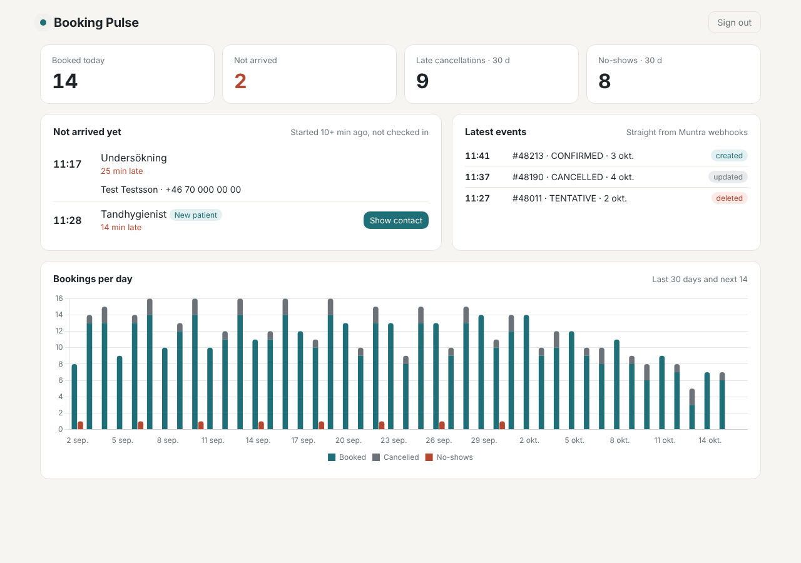

# Booking Pulse – step-by-step guide

**For:** clinic staff at the Muntra vibe-coding event. No coding experience needed.
**You'll end up with:** your own live dashboard that shows today's bookings and which patients
haven't arrived yet. Then you keep building it with Claude.



You will not need to write code or type commands yourself. Claude does that. Your job is to
click through a few websites, copy some values, and tell Claude what you want.

> 🧪 **Test data only.** Everything in this guide uses a Muntra *test* clinic with made-up
> patients. Never connect it to your real clinic.

---

## Contents

- [Before the event (about 30 minutes)](#before-the-event-about-30-minutes)
- [Part 1 – Get it running (about 1 hour, together)](#part-1--get-it-running-about-1-hour-together)
- [Part 2 – Make it yours](#part-2--make-it-yours)
- [How to talk to Claude](#how-to-talk-to-claude)
- [Rules for patient data](#rules-for-patient-data)
- [When something goes wrong](#when-something-goes-wrong)
- [Words you'll hear](#words-youll-hear)

---

## Before the event (about 30 minutes)

Please do this at home or at work **before** the event. Installing things takes time, and
the Wi-Fi at the event will be busy.

Tick each box as you go.

### ☐ 1. Install the Claude app

1. Go to **claude.com/download** and install the app for your computer.
2. Open it and sign in. You need a **paid** Claude plan (Pro, Max, Team or Enterprise).
3. At the top of the app, check that you can see a tab called **Code**. That's where we'll work.

### ☐ 2. Install Node.js

Node.js is what runs the app on your computer.

1. Go to **nodejs.org**.
2. Click the big green button that says **LTS**.
3. Open the file you downloaded and click **Continue / Next** until it's done. Keep all the
   default choices.

### ☐ 3. Create a GitHub account and install GitHub Desktop

GitHub is where your copy of the app is saved online. GitHub Desktop is a simple app for
downloading and saving it.

1. Go to **github.com** and click **Sign up**. Use your work e-mail.
2. Go to **desktop.github.com**, download GitHub Desktop and install it.
3. Open GitHub Desktop and sign in with your new GitHub account.

### ☐ 4. Create a Supabase account

Supabase is where your app's data is stored and where it receives bookings from Muntra.

1. Go to **supabase.com** and click **Start your project**.
2. Choose **Continue with GitHub** and approve. That's it, the free plan is enough.

### ☐ 5. Check that everything works

1. Open the Claude app and click the **Code** tab.
2. Under the message box, choose **Local**, and choose your **Documents** folder as the project folder.
3. Copy this message into the box and press **Enter**:

   ```
   Please check that Node.js version 22 or newer and Git are installed on my computer.
   Explain the result in simple words. If something is missing, tell me how to install it.
   ```

4. If Claude asks for permission to run a command, click **Allow**.
5. On a Mac, a window may pop up asking to install "command line developer tools". Click
   **Install** and wait for it to finish. That's normal.

✅ **You're ready** when Claude says both Node.js and Git are installed.

---

## Part 1 – Get it running (about 1 hour, together)

We'll do this together at the event. Keep this guide open, and keep a note open (Notes,
Notepad or similar) to paste values into as you go.

At the event you'll get a card from the Muntra hosts with:

- a login to a **Muntra test clinic**
- a **Muntra API address** (`MUNTRA_API_BASE_URL`)
- a **Muntra API key** (`MUNTRA_API_TOKEN`)

### Step 1 – Make your own copy on GitHub

1. Open **github.com/Teeth-to-Tech/booking-pulse**.
2. Click the green **Use this template** button, then **Create a new repository**.
3. **Owner:** choose your own name. **Repository name:** `booking-pulse`.
4. Choose **Private**.
5. Check that **Start with a template** says **Teeth-to-Tech/booking-pulse**.
   If it says *No template*, go back to step 1 and use the green button. Otherwise your copy will be empty.
6. Click **Create repository**.

✅ You now have your own copy at `github.com/<your-name>/booking-pulse`.

### Step 2 – Download it to your computer

1. Open **GitHub Desktop**.
2. Click **File → Clone repository**.
3. Find **booking-pulse** in the list and click it.
4. Leave the folder as it is and click **Clone**.
5. Note the folder it shows (usually `Documents/GitHub/booking-pulse`).

### Step 3 – Create your Supabase project

1. Go to **supabase.com/dashboard** and click **New project**.
2. **Name:** `booking-pulse`.
3. **Database password:** click **Generate a password**, then **copy it and paste it in your
   note**. You'll need it in a minute, and you can't see it again later.
4. **Region:** choose **Stockholm** (or Frankfurt). Always pick a European region.
5. Click **Create new project** and wait 1–2 minutes until it's ready.

Now collect two values and paste them in your note:

| What | Where to find it |
|---|---|
| **Project URL** | In your project: **Project Settings** (gear icon, bottom left) → **Data API** → *Project URL*. It looks like `https://abcdefghijklmnopqrst.supabase.co` |
| **Access token** | Click your **avatar** (top right) → **Account preferences** → **Access Tokens** → **Generate new token**. Name it `booking-pulse` and copy it. |

### Step 4 – Give Claude your settings

1. Open the Claude app → **Code** tab.
2. Choose **Local**, and as the project folder choose the **booking-pulse** folder from step 2.
3. Copy this message into the box and press **Enter**:

   ```
   Help me create my .env file from .env.example. Ask me for one value at a time,
   tell me where I can find it, and fill it in for me. Skip MUNTRA_WEBHOOK_SECRET.
   ```

4. Answer Claude's questions with the values from your note and from the Muntra card:

   | Claude asks for | You answer with |
   |---|---|
   | `SUPABASE_URL` | the Project URL from step 3 |
   | `SUPABASE_ACCESS_TOKEN` | the access token from step 3 |
   | `SUPABASE_DB_PASSWORD` | the database password from step 3 |
   | `DASHBOARD_EMAIL` | your e-mail (this is the login for *your* dashboard) |
   | `DASHBOARD_PASSWORD` | make up a password, at least 8 characters, and write it in your note |
   | `MUNTRA_API_BASE_URL` | from the Muntra card |
   | `MUNTRA_API_TOKEN` | from the Muntra card |

> 🔒 The `.env` file stays on your computer. It is never uploaded to GitHub.

### Step 5 – Let Claude set everything up

Copy this message into Claude and press **Enter**:

```
Run npm install and then npm run setup. Show me the result. If something fails,
explain what went wrong in simple words and help me fix it.
```

Click **Allow** whenever Claude asks to run a command. This takes 2–4 minutes. You'll see
eight steps tick by:

```
[1/8] Checking your .env file
[2/8] Connecting to your Supabase project
[3/8] Creating the database tables
[4/8] Saving secrets for the functions
[5/8] Deploying the functions
[6/8] Connecting the dashboard to Supabase
[7/8] Creating your dashboard login
[8/8] Connecting Muntra
All done! 🎉
```

✅ **Done** when you see **All done! 🎉**. If a step fails, the message tells you what to do.
Fix it and ask Claude to run setup again. Steps already done are skipped.

### Step 6 – Open your dashboard

Tell Claude:

```
Start the dashboard in the background with npm run dashboard, and tell me which address to open.
```

1. Open **http://localhost:5173** in your web browser.
2. Sign in with your `DASHBOARD_EMAIL` and `DASHBOARD_PASSWORD`.

You'll see an empty dashboard. That's right, no bookings have arrived yet.

### Step 7 – Send a pretend booking

Tell Claude:

```
Run npm run test-webhook -- --minutes -25
```

Look at your dashboard. Within a few seconds a booking appears under **Latest events**, and
a patient who is **25 minutes late** appears under **Not arrived yet**.

(The pretend patient doesn't exist in Muntra, so **Show contact** won't work for this one.
That's expected.)

### Step 8 – Try it with Muntra 🎉

1. Log in to your **Muntra test clinic**.
2. Create a booking for one of the test patients that **started 15 minutes ago**.
3. Watch your dashboard. The booking shows up by itself.
4. Click **Show contact**. The patient's name and number are fetched live from Muntra.
5. In Muntra, check the patient in as **arrived**. Watch them disappear from the list.

**Congratulations, you've built a working Muntra integration!**

### Step 9 – Save your work

Do this every time something works the way you like.

1. Open **GitHub Desktop**. It lists the files Claude changed.
2. Bottom left, write a short note in **Summary**, for example `Dashboard is running`.
3. Click **Commit to main**.
4. Click **Push origin** at the top.

Your work is now saved in your private GitHub copy.

---

## Part 2 – Make it yours

Now it's your turn. Tell Claude what would help your clinic, in your own words. Claude
already knows how the app works and which rules to follow.

Start with a green idea, then move on when it works.

### 🟢 Easy

**Today's bookings**
```
Add a list of today's bookings with time, booking type and status. Show cancelled ones in grey.
```

**Worst time slots**
```
Show no-shows and late cancellations per weekday and per hour, so we can see our worst time slots.
```

**In Swedish (or Norwegian, or Danish)**
```
Translate everything in the dashboard into Swedish.
```

**Our colours**
```
Change the colours of the dashboard to match our clinic: our main colour is #......
```

### 🟡 A bit more

**Keep track of calls**
```
On each late patient, add buttons "Called – no answer", "Called – on the way" and "Rebook".
Save which button was clicked, by whom and when, and show it in the list.
```

**Risky bookings tomorrow**
```
Show tomorrow's bookings that might be no-shows: booked more than 3 months ago, or the
patient has missed a booking before.
```

**Fill cancelled slots**
```
When a booking is cancelled, show patients who want an earlier time, so reception can offer them the slot.
```

### 🔴 Advanced

**No-show follow-up list**
```
Make a list of patients who missed a booking in the last 14 days and haven't booked a new time yet.
Use the Muntra API to check for new bookings.
```

**Weekly summary**
```
Every Monday morning, save a summary of last week: number of bookings, cancellations,
no-shows and how many patients arrived on time. Show the last 8 weeks in the dashboard.
```

---

## How to talk to Claude

- **One thing at a time.** Ask for one change, check that it works, save it (step 9), then ask for the next.
- **Say what you see.** "The button is there but nothing happens when I click it" helps Claude a lot more than "it doesn't work".
- **Ask for an explanation.** "Explain what you changed in simple words" is always a good question.
- **Undo is fine.** "That wasn't what I meant, please undo your last change" works.
- **Stuck?** Paste the error message into Claude and write "What does this mean and how do I fix it?"
- **Allow, but read.** When Claude asks for permission, the box shows what it wants to do. If it looks strange, click **Deny** and ask why.
- **Refresh the dashboard** in your browser after Claude changes it.

---

## Rules for patient data

These rules are already built in, and Claude knows them. They're here so you know why
Claude sometimes says no.

1. **The app stores booking numbers, not people.** Names, personal identity numbers, addresses and
   phone numbers are never saved in Supabase.
2. **Contact details are looked up when you click.** They're shown, not saved.
3. **No automatic messages to patients.** The app suggests. A person decides and calls.
4. **Only read from Muntra.** The app doesn't change bookings or patients.
5. **Test clinic only.** Want to use it for real later? Talk to Muntra first.

---

## When something goes wrong

**First, always try this:** copy the error message into Claude and write
*"Explain this in simple words and help me fix it."*

| What you see | What to do |
|---|---|
| Claude says Node.js or Git is missing | Do [Before the event](#before-the-event-about-30-minutes) steps 2 and 5 again. Then quit and reopen the Claude app. |
| Setup: *"These are still empty in .env"* | Ask Claude: "Help me fill in the missing values in .env." |
| Setup: *"Supabase didn't accept the access token"* | Make a new token (step 3) and ask Claude to replace `SUPABASE_ACCESS_TOKEN` in .env. |
| Setup fails at *Creating the database tables* | The database password is probably wrong. In Supabase: **Project Settings → Database → Reset database password**, then update .env. |
| Setup fails at *Connecting Muntra* | Check the Muntra values on your card. Still failing? Ask a Muntra host. |
| The dashboard page won't open | Ask Claude: "Start the dashboard again with npm run dashboard." |
| I can't sign in to the dashboard | Check e-mail and password in .env. Ask Claude to run `npm run setup` again. |
| Pretend booking doesn't appear | Refresh the page. Then ask Claude to run `npm run test-webhook` and show you the result. |
| Muntra bookings don't appear | Ask Claude: "Run npm run register-webhooks -- --list and explain the result." |
| **Show contact** says it couldn't load | Normal for pretend bookings. For a real test booking: check `MUNTRA_API_TOKEN` and run setup again. |
| Everything broke after a change | Tell Claude: "Undo your last change." Or in GitHub Desktop: right-click the changed files → **Discard changes** to go back to your last save. |

---

## Words you'll hear

| Word | What it means |
|---|---|
| **GitHub** | A website where your app's files are saved online. |
| **Repository (repo)** | Your app's folder on GitHub. |
| **Clone** | Download a copy of a repo to your computer. |
| **Commit / Push** | Save your changes (commit) and upload them to GitHub (push). |
| **Supabase** | The online service where your app's data lives. |
| **Database** | Tables where the app stores bookings, like a spreadsheet. |
| **Webhook** | A message Muntra sends to your app the moment a booking changes. |
| **Function** | A small piece of your app that runs online at Supabase, for example the one that receives webhooks. |
| **API** | The way your app asks Muntra for information, for example a patient's phone number. |
| **.env** | A settings file on your computer with your passwords and keys. Never shared. |
| **localhost** | Your own computer. `http://localhost:5173` is your dashboard running on your computer. |
| **Terminal / command** | Text instructions to the computer. Claude types these for you. |
